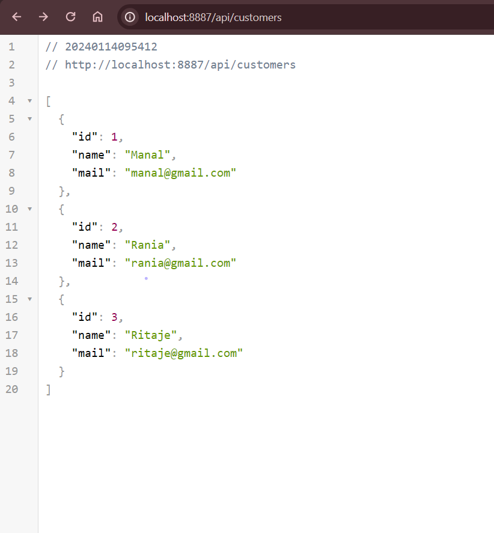
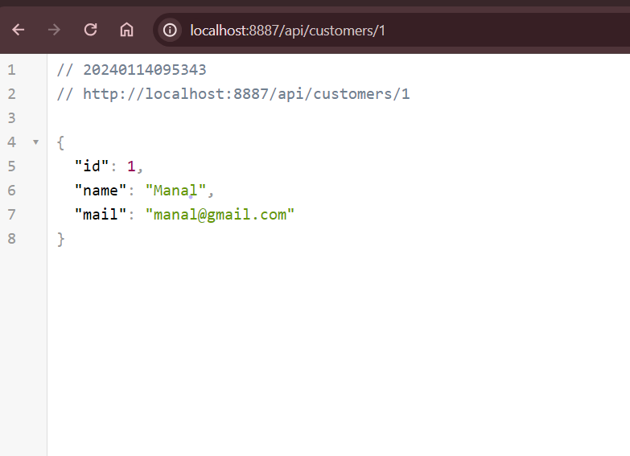
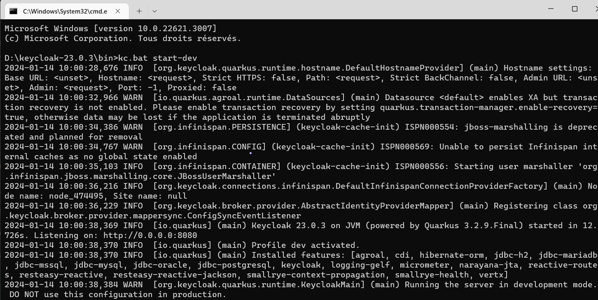
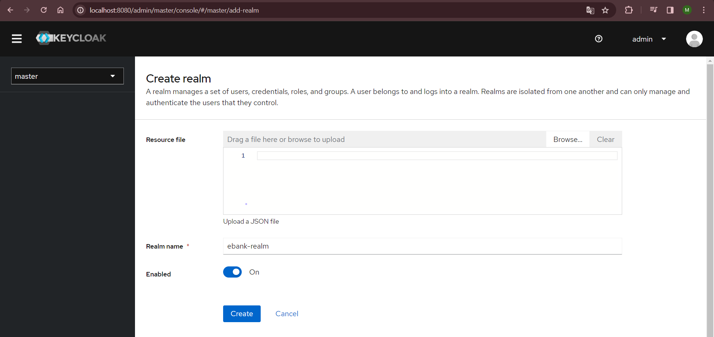
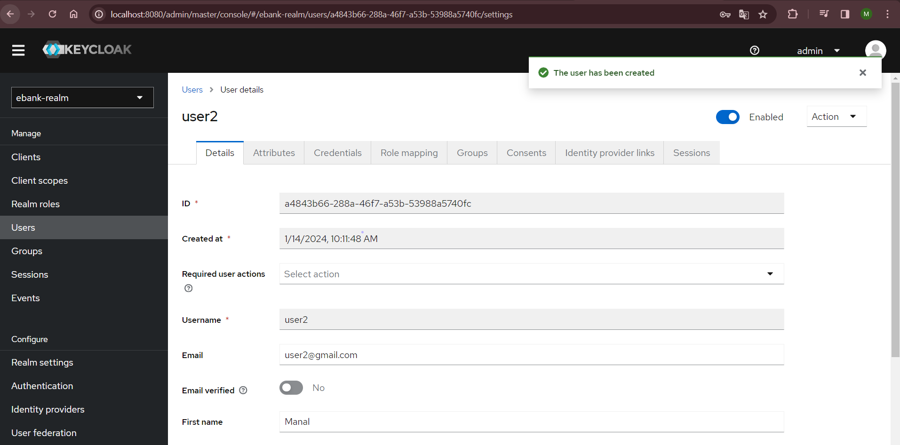
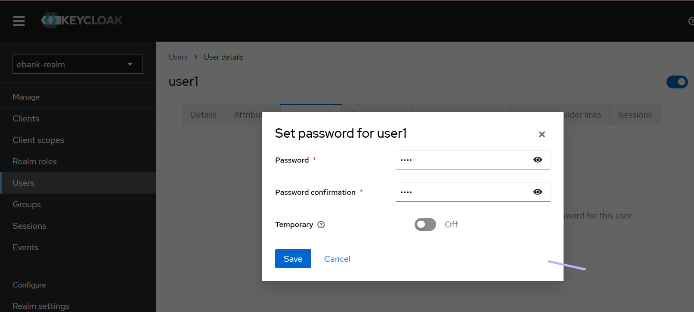
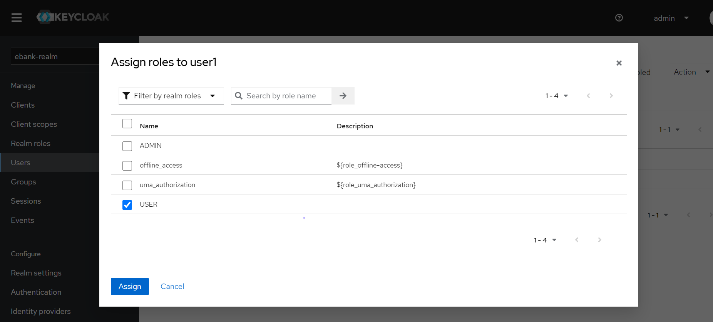
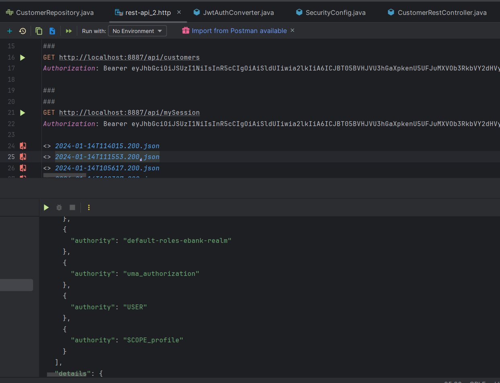
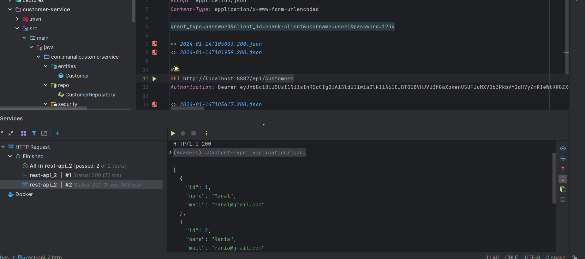

<h1>GASMI MANAL</h1>
<h3>Activité Pratique N°5 :Sécuriser un micro-service avec OAuth2 OIDC avec Keycloak  </h3>

<h2> Liste des clients </h2>

<h2>Récuperer un client avec son Id</h2>

<h2>Intégration d'Open Api visualisation des deux endpoints</h2>

<h2>Interface d'authentification par défaut apppliquée par Spring Security</h2>

<h2>Partie Keycloak</h2>
<h2>Lancer Keycloak</h2>

<h2>Interface de console Admin</h2>

<h2>Création de realm</h2>

<h2>Création de Clients</h2>

<h2>Création de User</h2>

<h2>Affectation de mot de passe pour User</h2>

<h2>Création des roles </h2>

<h2>Affecter roles aux users</h2>

<h2>Endpoints de configuration Keycloak</h2>

<h2>Certificat ebank-realm</h2>

<h2>Informations de l'objet Authentication</h2>

<h2>Erreur 401 il faut s'authentification</h2>

<h2>Erreur 403 il faut avoir le droit d'accés</h2>

<h2>Grant type Password</h2>

<h2>Ajout Authority USER</h2>

<h2>AApreés l'ajout la requete GET passe avec succes</h2>

